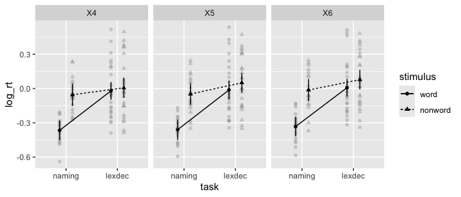
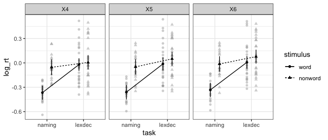
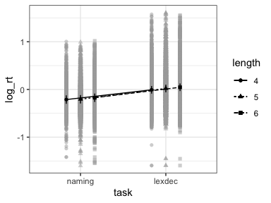

<!-- README.md is generated from README.Rmd. Please edit that file -->

# afex: Analysis of Factorial EXperiments

<!-- badges: start -->

[](https://CRAN.R-project.org/package=afex)
[](https://github.com/singmann/afex)
[](https://r-pkg.org/pkg/afex)
[](http://depsy.org/package/r/afex)
[](https://travis-ci.org/singmann/afex)
[](https://github.com/singmann/afex/actions)
<!-- badges: end -->

The main functionalities provided by `afex` are:

1.  Interfaces for estimating standard ANOVAs with any number or
    combination of within-subjects or between-subjects variables (the
    ANOVA functions are `aov_car()`, `aov_ez()`, and `aov_4()` which all
    fit the same model but differ in the way to specify the ANOVA
    model).
2.  Function `mixed()` provides an interface for mixed models analysis
    (estimated via `lme4` `lmer` or `glmer`) that automatically obtains
    *p*-values for fixed effects model terms (i.e., main effects and
    interactions).
3.  `afex_plot()` visualizes results from factorial experiments
    combining estimated marginal means and uncertainties associated with
    the estimated means in the foreground with a depiction of the raw
    data in the background.  
4.  All `afex` model objects (i.e., ANOVA and mixed models) can be
    passed to `emmeans` for follow-up/post-hoc/planned contrast
    analysis.

For `afex` support visit:
[afex.singmann.science](http://afex.singmann.science/)

## Installation

  - `afex` is available from CRAN so the current stable version can be
    installed directly via: `install.packages("afex")`

  - To install the latest development version you will need the
    [`devtools`](https://github.com/r-lib/devtools) package:
    `devtools::install_github("singmann/afex@master")`

## ANOVA functionality

To calculate an ANOVA, `afex` requires the data to be in the long format
(i.e., one row per data point/observation). An ANOVA can then be
calculated via one of three functions that only differ in how the model
components are specified, but not in the output. Note that in contrast
to base `lm` or `aov`, `afex` ANOVA functions always require the
specification of a subject identifier column (the id-column), because in
case there are multiple observations per participant and cell of the
design, these multiple observations are aggregated (i.e., averaged) per
default.

  - In `aov_ez` the columns containing id variable, dependent variable,
    and factors need to be specified as character vectors.
  - `aov_car` behaves similar to standard `aov` and requires the ANOVA
    to be specified as a formula containing an `Error` term (at least to
    identify the id variable).
  - `aov_4` allows the ANOVA to be specified via a formula similar to
    `lme4::lmer` (with one random effects term).

A further overview is provided by the
[vignette](https://cran.r-project.org/package=afex/vignettes/afex_anova_example.html).

The following code provides a simple example for an ANOVA with both
between- and within-subject factors. For this we use the
lexical-decision and word naming latencies reported by Freeman,
Heathcote, Chalmers, and Hockley (2010), see also `?fhch2010`. As is
commonly done, we use the natural logarithm of the response times,
`log_rt`, as dependent variable. As independent variable we will
consider the between-subjects factor `task` (`"naming"` or `"lexdec"`)
as well as the within-subjects-factors `stimulus` (`"word"` or
`"nonword"`) and `length` (with 3 levels, 3, 4, or 5 letters).

``` r
library("afex")
# examples data set with both within- and between-subjects factors (see ?fhch2010)
data("fhch2010", package = "afex")
fhch <- fhch2010[ fhch2010$correct,] # remove errors
str(fhch2010) # structure of the data
#> 'data.frame':    13222 obs. of  10 variables:
#>  $ id       : Factor w/ 45 levels "N1","N12","N13",..: 1 1 1 1 1 1 1 1 1 1 ...
#>  $ task     : Factor w/ 2 levels "naming","lexdec": 1 1 1 1 1 1 1 1 1 1 ...
#>  $ stimulus : Factor w/ 2 levels "word","nonword": 1 1 1 2 2 1 2 2 1 2 ...
#>  $ density  : Factor w/ 2 levels "low","high": 2 1 1 2 1 2 1 1 1 1 ...
#>  $ frequency: Factor w/ 2 levels "low","high": 1 2 2 2 2 2 1 2 1 2 ...
#>  $ length   : Factor w/ 3 levels "4","5","6": 3 3 2 2 1 1 3 2 1 3 ...
#>  $ item     : Factor w/ 600 levels "abide","acts",..: 363 121 202 525 580 135 42 368 227 141 ...
#>  $ rt       : num  1.091 0.876 0.71 1.21 0.843 ...
#>  $ log_rt   : num  0.0871 -0.1324 -0.3425 0.1906 -0.1708 ...
#>  $ correct  : logi  TRUE TRUE TRUE TRUE TRUE TRUE ...
```

``` r
# estimate mixed ANOVA on the full design:
aov_ez("id", "log_rt", fhch, between = "task", within = c("stimulus", "length"))
aov_car(log_rt ~ task * stimulus * length + Error(id/(stimulus * length)), 
        data = fhch)
## equivalent: aov_car(log_rt ~ task + Error(id/(stimulus * length)), data = fhch)

aov_4(log_rt ~ task * stimulus * length + (stimulus * length|id), data = fhch)
## equivalent: aov_4(log_rt ~ task  + (stimulus * length|id), data = fhch)

# the three calls return the same ANOVA table:
```

    #> Warning: More than one observation per cell, aggregating the data using mean
    #> (i.e, fun_aggregate = mean)!
    #> Contrasts set to contr.sum for the following variables: task
    #> Anova Table (Type 3 tests)
    #> 
    #> Response: log_rt
    #>                 Effect          df  MSE          F   ges p.value
    #> 1                 task       1, 43 0.23  13.38 ***  .221   <.001
    #> 2             stimulus       1, 43 0.01 173.25 ***  .173   <.001
    #> 3        task:stimulus       1, 43 0.01  87.56 ***  .096   <.001
    #> 4               length 1.83, 78.64 0.00  18.55 ***  .008   <.001
    #> 5          task:length 1.83, 78.64 0.00       1.02 <.001    .358
    #> 6      stimulus:length 1.70, 72.97 0.00       1.91 <.001    .162
    #> 7 task:stimulus:length 1.70, 72.97 0.00       1.21 <.001    .298
    #> ---
    #> Signif. codes:  0 '***' 0.001 '**' 0.01 '*' 0.05 '+' 0.1 ' ' 1
    #> 
    #> Sphericity correction method: GG

### Plotting with `afex_plot`

ANOVA models can be used for plotting via `afex_plot`:

``` r
a <- aov_ez("id", "log_rt", fhch, between = "task", within = c("stimulus", "length"))
#> Warning: More than one observation per cell, aggregating the data using mean
#> (i.e, fun_aggregate = mean)!
```

``` r
afex_plot(a, "task", "stimulus", "length")
#> Warning: Panel(s) show a mixed within-between-design.
#> Error bars do not allow comparisons across all means.
#> Suppress error bars with: error = "none"
```

<!-- -->

`afex_plot` returns a `ggplot2` plot object which allows simple
customization:

``` r
library("ggplot2")
afex_plot(a, "task", "stimulus", "length") + 
  theme_bw()
#> Warning: Panel(s) show a mixed within-between-design.
#> Error bars do not allow comparisons across all means.
#> Suppress error bars with: error = "none"
```

<!-- -->

### Follow-up Tests with `emmeans`

Follow-up tests with `emmeans` need to be specified in two steps.

1.  Decide which factors of model should be involved in tests. Use these
    factors to set-up reference grid of marginal means using
    `emmeans()`.
2.  Specify set of tests on reference grid from step 1. Either custom
    contrasts as a `list` and using `contrast()` or a convenience
    function such as `pairs()`.

<!-- end list -->

``` r
library("emmeans")
## set up reference grid using only length
em1 <- emmeans(a, "length")
#> NOTE: Results may be misleading due to involvement in interactions
em1
#>  length  emmean     SE   df lower.CL upper.CL
#>  X4     -0.0968 0.0293 44.8   -0.156 -0.03772
#>  X5     -0.0810 0.0293 44.8   -0.140 -0.02186
#>  X6     -0.0534 0.0293 44.8   -0.113  0.00572
#> 
#> Results are averaged over the levels of: task, stimulus 
#> Warning: EMMs are biased unless design is perfectly balanced 
#> Confidence level used: 0.95

## test all pairwise comparisons on reference grid:
pairs(em1)
#>  contrast estimate      SE df t.ratio p.value
#>  X4 - X5   -0.0159 0.00722 86 -2.197  0.0774 
#>  X4 - X6   -0.0434 0.00722 86 -6.018  <.0001 
#>  X5 - X6   -0.0276 0.00722 86 -3.821  0.0007 
#> 
#> Results are averaged over the levels of: task, stimulus 
#> P value adjustment: tukey method for comparing a family of 3 estimates

## only test specified tests
con <- list(
  "4vs5" = c(-1, 1, 0),
  "5vs6" = c(0, -1, 1)
)
contrast(em1, con, adjust = "holm")
#>  contrast estimate      SE df t.ratio p.value
#>  4vs5       0.0159 0.00722 86 2.197   0.0307 
#>  5vs6       0.0276 0.00722 86 3.821   0.0005 
#> 
#> Results are averaged over the levels of: task, stimulus 
#> P value adjustment: holm method for 2 tests
```

## Mixed Models

Function `mixed()` fits a mixed model with `lme4::lmer` (or
`lme4::glmer` if a `family` argument is passed) and then calculates
*p*-values for fixed effects model terms using a variety of methods. The
formula to `mixed` needs to be the same as in a call to `lme4::lmer`.
The default method for calculation of *p*-values is `'KR'`
(Kenward-Roger) which only works for linear mixed models (i.e., no
`family` argument) and can require considerable RAM and time, but
provides the best control of Type I errors. Other methods are `'S'`
(Satterthwaite, similar to `'KR'` but requires less RAM), `'PB'`
(parametric bootstrap), and `'LRT'` (likelihood-ratio test).

More examples are provided in the
[vignette](https://cran.r-project.org/package=afex/vignettes/afex_mixed_example.html),
here we use the same example data as above, the lexical decision and
word naming latencies collected by Freeman et al. (2010). To avoid long
computation times we only consider the two factors `task` and `length`
(omitting `stimulus` is probably not a fully sensible model). Because
mixed models easily allow it, we will consider crossed-random effects
for participants (`id`) and items (`tem`).

``` r
library("afex")
# examples data set with both within- and between-subjects factors (see ?fhch2010)
data("fhch2010", package = "afex")
fhch <- fhch2010[ fhch2010$correct,] # remove errors
str(fhch2010) # structure of the data
#> 'data.frame':    13222 obs. of  10 variables:
#>  $ id       : Factor w/ 45 levels "N1","N12","N13",..: 1 1 1 1 1 1 1 1 1 1 ...
#>  $ task     : Factor w/ 2 levels "naming","lexdec": 1 1 1 1 1 1 1 1 1 1 ...
#>  $ stimulus : Factor w/ 2 levels "word","nonword": 1 1 1 2 2 1 2 2 1 2 ...
#>  $ density  : Factor w/ 2 levels "low","high": 2 1 1 2 1 2 1 1 1 1 ...
#>  $ frequency: Factor w/ 2 levels "low","high": 1 2 2 2 2 2 1 2 1 2 ...
#>  $ length   : Factor w/ 3 levels "4","5","6": 3 3 2 2 1 1 3 2 1 3 ...
#>  $ item     : Factor w/ 600 levels "abide","acts",..: 363 121 202 525 580 135 42 368 227 141 ...
#>  $ rt       : num  1.091 0.876 0.71 1.21 0.843 ...
#>  $ log_rt   : num  0.0871 -0.1324 -0.3425 0.1906 -0.1708 ...
#>  $ correct  : logi  TRUE TRUE TRUE TRUE TRUE TRUE ...
```

Because the data has plenty of levels of the random effect grouping
factors we use the Satterthwaite method. For the random-effects grouping
factors we begin with the maximal random effect structure justified by
the design (see Barr, Levy, Scheepers, & Tily, 2013). In this case this
is by-subject random intercepts and by-subjects random slopes for
`stimulus` and by-item random intercepts and by-item random slopes for
`task`.

``` r
m1 <- mixed(log_rt ~ task * length + 
              (length | id) + (task | item), 
            fhch, method = "S")
#> Contrasts set to contr.sum for the following variables: task, length, id, item
#> Fitting one lmer() model.
#> boundary (singular) fit: see ?isSingular
#> [DONE]
#> Calculating p-values. [DONE]
```

Fitting this model produces a critical convergence warning, that the fit
is singular. This warning usually indicates that the data does not
provide enough information for the request random effect parameters. In
a real analysis it would therefore be a good idea to iteratively reduce
the random effect structure until the warning disappears. A good first
step would be to remove the correlations among random effect terms as
shown below.

This warning is also shown if we simply print the model object, but not
if we call the `nice()` method.

``` r
m1
#> Warning: lme4 reported (at least) the following warnings for 'full':
#>   * boundary (singular) fit: see ?isSingular
#> Mixed Model Anova Table (Type 3 tests, S-method)
#> 
#> Model: log_rt ~ task * length + (length | id) + (task | item)
#> Data: fhch
#>        Effect        df         F p.value
#> 1        task  1, 44.80 13.47 ***   <.001
#> 2      length 2, 325.78   6.03 **    .003
#> 3 task:length 2, 303.23      0.33    .722
#> ---
#> Signif. codes:  0 '***' 0.001 '**' 0.01 '*' 0.05 '+' 0.1 ' ' 1
nice(m1)
#> Mixed Model Anova Table (Type 3 tests, S-method)
#> 
#> Model: log_rt ~ task * length + (length | id) + (task | item)
#> Data: fhch
#>        Effect        df         F p.value
#> 1        task  1, 44.80 13.47 ***   <.001
#> 2      length 2, 325.78   6.03 **    .003
#> 3 task:length 2, 303.23      0.33    .722
#> ---
#> Signif. codes:  0 '***' 0.001 '**' 0.01 '*' 0.05 '+' 0.1 ' ' 1
```

If we call the `anova()` method a slightly different output is shown in
which the p-values are not rounded in the same way and the warning is
shown again.

``` r
anova(m1)
#> Warning: lme4 reported (at least) the following warnings for 'full':
#>   * boundary (singular) fit: see ?isSingular
#> Mixed Model Anova Table (Type 3 tests, S-method)
#> 
#> Model: log_rt ~ task * length + (length | id) + (task | item)
#> Data: fhch
#>             num Df  den Df       F    Pr(>F)    
#> task             1  44.797 13.4692 0.0006426 ***
#> length           2 325.775  6.0255 0.0026940 ** 
#> task:length      2 303.227  0.3263 0.7218472    
#> ---
#> Signif. codes:  0 '***' 0.001 '**' 0.01 '*' 0.05 '.' 0.1 ' ' 1
```

We can also get the default `lme4` output if we call the `summary`
method. However, note that in contrast to the previous methods, results
are shown for factor-levels and not model-terms which is usually not
interpretable for factors with more than two levels. This is the case
for `length` here. The problem is that factors with \(k\) levels are
mapped to \(k-1\) parameters and at the same time the intercept
represent the (unweighted) grand mean. This means that factor-levels
cannot be mapped in a 1-to-1 manner to the parameters and thus cannot be
uniquely interpreted.

``` r
summary(m1)
#> Linear mixed model fit by REML. t-tests use Satterthwaite's method [
#> lmerModLmerTest]
#> Formula: log_rt ~ task * length + (length | id) + (task | item)
#>    Data: data
#> 
#> REML criterion at convergence: 7624.2
#> 
#> Scaled residuals: 
#>     Min      1Q  Median      3Q     Max 
#> -5.9267 -0.5900 -0.1018  0.4789  5.2673 
#> 
#> Random effects:
#>  Groups   Name        Variance  Std.Dev. Corr       
#>  item     (Intercept) 0.0115702 0.10756             
#>           task1       0.0104587 0.10227  0.47       
#>  id       (Intercept) 0.0374050 0.19340             
#>           length1     0.0003297 0.01816   0.16      
#>           length2     0.0001009 0.01005   0.11 -0.96
#>  Residual             0.0925502 0.30422             
#> Number of obs: 12960, groups:  item, 600; id, 45
#> 
#> Fixed effects:
#>                 Estimate Std. Error         df t value Pr(>|t|)    
#> (Intercept)    -0.089098   0.029468  44.989068  -3.024 0.004117 ** 
#> task1          -0.108035   0.029437  44.797243  -3.670 0.000643 ***
#> length1        -0.020756   0.007810 226.902599  -2.658 0.008425 ** 
#> length2        -0.003746   0.007467 380.122063  -0.502 0.616214    
#> task1:length1   0.005719   0.007569 206.633789   0.756 0.450736    
#> task1:length2  -0.004627   0.007214 353.115359  -0.641 0.521661    
#> ---
#> Signif. codes:  0 '***' 0.001 '**' 0.01 '*' 0.05 '.' 0.1 ' ' 1
#> 
#> Correlation of Fixed Effects:
#>             (Intr) task1  lngth1 lngth2 tsk1:1
#> task1        0.118                            
#> length1      0.056  0.007                     
#> length2      0.021  0.002 -0.526              
#> tsk1:lngth1  0.007  0.058  0.329 -0.173       
#> tsk1:lngth2  0.003  0.022 -0.174  0.349 -0.528
#> convergence code: 0
#> boundary (singular) fit: see ?isSingular
```

### Reducing the Random Effect Structure

Because of the singular fit warning, we reduce the random effect
structure. Usually a good starting point is removing the correlations
among the random effects parameters. This can be done in `afex::mixed`
even for factors by combining the double bar notation `||` with
`expand_re = TRUE`. We do so for both random effects terms.

``` r
m2 <- mixed(log_rt ~ task * length + 
              (length || id) + (task || item), 
            fhch, method = "S", expand_re = TRUE)
#> Contrasts set to contr.sum for the following variables: task, length, id, item
#> Fitting one lmer() model.
#> boundary (singular) fit: see ?isSingular
#> [DONE]
#> Calculating p-values. [DONE]
```

However, the singular fit warning remains. We therefore inspect the
random effect estimates to see which random effect parameter is
estimated to be near to zero.

``` r
summary(m2)$varcor
#>  Groups   Name        Std.Dev.  
#>  item     re2.task1   1.0119e-01
#>  item.1   (Intercept) 1.0685e-01
#>  id       re1.length2 3.1129e-06
#>  id.1     re1.length1 1.2292e-02
#>  id.2     (Intercept) 1.9340e-01
#>  Residual             3.0437e-01
```

As shown above, one parameter of the by-participant random slope for
`length` is estimated to be almost zero, `re1.length2`. We therefore
remove the by-participant random slope for `length` in the next model
which does not show any convergence warnings.

``` r
m3 <- mixed(log_rt ~ task * length + 
              (1 | id) + (task || item), 
            fhch, method = "S", expand_re = TRUE)
#> Contrasts set to contr.sum for the following variables: task, length, id, item
#> Fitting one lmer() model. [DONE]
#> Calculating p-values. [DONE]
m3
#> Mixed Model Anova Table (Type 3 tests, S-method)
#> 
#> Model: log_rt ~ task * length + (1 | id) + (task || item)
#> Data: fhch
#>        Effect        df         F p.value
#> 1        task  1, 44.74 13.52 ***   <.001
#> 2      length 2, 597.20   6.67 **    .001
#> 3 task:length 2, 592.82      0.40    .668
#> ---
#> Signif. codes:  0 '***' 0.001 '**' 0.01 '*' 0.05 '+' 0.1 ' ' 1
```

### Plotting with `afex_plot`

Objects returned by `mixed` can be used for plotting with `afex_plot`.
However, two things need to be considered.

  - The `id` argument of `afex_plot` allows specifying over which random
    effects grouping factors the data plotted in the background should
    be averaged over. Per default this uses all random effects grouping
    factors. In the present case this would mean that all data points
    are shown resulting in a very busy plot. When choosing only one of
    the random effects grouping factor, data points in the background
    show average response for each level of that factor. For example,
    when setting `id = "id"` here each data point in the background
    shows the mean `log_rt` of one participant (i.e., level of `id`).
  - Estimated marginal means in the foreground are estimated via
    `emmeans` which per default attempts to estimate the degrees of
    freedom using the expensive Kenward-Roger method unless the number
    of data points is high (as here). This can produce quite some status
    messages (not shown here). Use `emmeans::emm_options(lmer.df =
    "asymptotic")` to suppress this calculation.

<!-- end list -->

``` r
library("ggplot2")
## all data points shown
afex_plot(m3, "task", "length") + 
  theme_bw()
```

<!-- -->

``` r
## data points show IDs
afex_plot(m3, "task", "length", id = "id") + 
  theme_bw()
```

<!-- -->

``` r
## data points show items
afex_plot(m3, "task", "length", id = "item") + 
  theme_bw()
```

<!-- -->

### Follow-up Tests with `emmeans`

Follow-up tests with `emmeans` need to be specified in two steps.

1.  Decide which factors of model should be involved in tests. Use these
    factors to set-up reference grid of marginal means using
    `emmeans()`.
2.  Specify set of tests on reference grid from step 1. Either custom
    contrasts as a `list` and using `contrast()` or a convenience
    function such as `pairs()`.

For mixed models, `emmeans` attempts to estimate the degrees of freedom.
The method can be set via `emm_options(lmer.df = ...)`. Here we use
`"asymptotic"` which does not estimate the degrees of freedom, but sets
them to infinity.

``` r
library("emmeans")
emm_options(lmer.df = "asymptotic")
## set up reference grid using only length
em2 <- emmeans(m3, "length")
#> NOTE: Results may be misleading due to involvement in interactions
em2
#>  length  emmean     SE  df asymp.LCL asymp.UCL
#>  4      -0.1099 0.0304 Inf    -0.169  -0.05040
#>  5      -0.0924 0.0304 Inf    -0.152  -0.03296
#>  6      -0.0642 0.0304 Inf    -0.124  -0.00469
#> 
#> Results are averaged over the levels of: task 
#> Degrees-of-freedom method: asymptotic 
#> Confidence level used: 0.95

## test all pairwise comparisons on reference grid:
pairs(em2)
#>  contrast estimate     SE  df z.ratio p.value
#>  4 - 5     -0.0175 0.0126 Inf -1.384  0.3495 
#>  4 - 6     -0.0457 0.0126 Inf -3.618  0.0009 
#>  5 - 6     -0.0282 0.0126 Inf -2.238  0.0649 
#> 
#> Results are averaged over the levels of: task 
#> Degrees-of-freedom method: asymptotic 
#> P value adjustment: tukey method for comparing a family of 3 estimates

## only test specified tests
con <- list(
  "4vs5" = c(-1, 1, 0),
  "5vs6" = c(0, -1, 1)
)
contrast(em2, con, adjust = "holm")
#>  contrast estimate     SE  df z.ratio p.value
#>  4vs5       0.0175 0.0126 Inf 1.384   0.1665 
#>  5vs6       0.0282 0.0126 Inf 2.238   0.0504 
#> 
#> Results are averaged over the levels of: task 
#> Degrees-of-freedom method: asymptotic 
#> P value adjustment: holm method for 2 tests
```

## References

Barr, D. J., Levy, R., Scheepers, C., & Tily, H. J. (2013). Random
effects structure for confirmatory hypothesis testing: Keep it maximal.
*Journal of Memory and Language*, 68(3), 255-278.
<https://doi.org/10.1016/j.jml.2012.11.001>

Freeman, E., Heathcote, A., Chalmers, K., & Hockley, W. (2010). Item
effects in recognition memory for words. *Journal of Memory and
Language*, 62(1), 1-18. <https://doi.org/10.1016/j.jml.2009.09.004>

## Code of Conduct

Please note that `afex` is released with a [Contributor Code of
Conduct](https://contributor-covenant.org/version/2/0/CODE_OF_CONDUCT.html).
By contributing to this project, you agree to abide by its terms.
